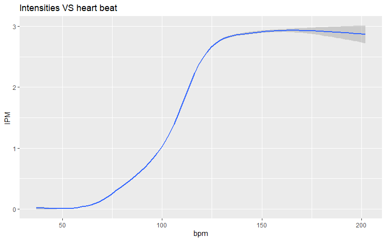

-   [1.Introduction](#introduction)
-   [2.Ask Phase](#ask-phase)
    -   [2.1 Questions guide my analysis base problem i want to answer
        in case
        study](#questions-guide-my-analysis-base-problem-i-want-to-answer-in-case-study)
    -   [2.2 Target group](#target-group)
    -   [2.3 Stakeholders](#stakeholders)
-   [3. Prepare Phase](#prepare-phase)
    -   [3.1 Data set used](#data-set-used)
    -   [3.2 Dataset content](#dataset-content)
    -   [3.3 Data distribution and
        validity](#data-distribution-and-validity)
-   [4. Process Phase](#process-phase)
    -   [4.1 Installing and loading libraries we use in this
        analysis](#installing-and-loading-libraries-we-use-in-this-analysis)
    -   [4.2 importing data](#importing-data)
    -   [4.3 Check Head data](#check-head-data)
    -   [4.4 Check Summary Dataframe](#check-summary-dataframe)
    -   [4.5 Checking dataset for duplicated and
        N/A](#checking-dataset-for-duplicated-and-na)
    -   [4.6 Cleaning and formatting](#cleaning-and-formatting)
    -   [4.7 checking format of data
        column](#checking-format-of-data-column)
    -   [4.8 checking number of users](#checking-number-of-users)
    -   [4.9 Merging Datafarme](#merging-datafarme)
-   [5.Analyze and Share Phase](#analyze-and-share-phase)
    -   [5.1 Histogram plot of daily
        data](#histogram-plot-of-daily-data)
    -   [5.2 Classification users](#classification-users)
    -   [5.3 Distribution of users](#distribution-of-users)
    -   [5.4 Activity of each user](#activity-of-each-user)
    -   [5.7 Correlations between steps and
        calories](#correlations-between-steps-and-calories)
    -   [5.8 reshape heartbeat per second and intensities and calories
        per
        minute](#reshape-heartbeat-per-second-and-intensities-and-calories-per-minute)
    -   [5.9 compare new datasets per minute - intensities and heart
        beat](#compare-new-datasets-per-minute---intensities-and-heart-beat)
    -   [5.10 compare new datasets per minute - heartbeat and
        calories](#compare-new-datasets-per-minute---heartbeat-and-calories)
    -   [5.11 compare new datasets per minute - calories and
        intensities](#compare-new-datasets-per-minute---calories-and-intensities)
    -   [5.12 average sleep per day](#average-sleep-per-day)
    -   [5.13 classification of sleep
        data](#classification-of-sleep-data)
    -   [5.14 activity and sleep](#activity-and-sleep)
    -   [5.15 checking weight dataframe](#checking-weight-dataframe)
-   [6. Act Phase](#act-phase)
    -   [6.1 Summary of our finding and
        trends](#summary-of-our-finding-and-trends)
    -   [6.2 Ways for applying this features for Bellabeat
        customers](#ways-for-applying-this-features-for-bellabeat-customers)
    -   [6.3 Infualnce marketing
        stradegy:](#infualnce-marketing-stradegy)
    -   [6.4 Women products element](#women-products-element)

</span> <a class="anchor" id="1.Introduction_1"></a>

## 1.Introduction

This project its capstone project of the Google Data Analytics in
Coursera. The Data use in this case study its from non-bellabeat users
and include data about activity,serenity,sleep,calories in
daily,hourly,minute dataframe and sleep base daily and weight info base
users import or sync data

</span> <a class="anchor" id="2_ask_Phase"></a>

## 2.Ask Phase

we want analysis data for answering some questions and recommend for
Stakeholders in bellabeat so we should explorer all gathering data from
Fitbit users and answer to questions its analysis and share data with
users or not.

</span> <a class="anchor" id="guide_qa_2_1"></a>

### 2.1 Questions guide my analysis base problem i want to answer in case study

    1. What are some trends in smart device usage?
    2. How could these trends apply to Bellabeat customers?
    3. How could these trends help influence Bellabeat marketing strategy?

</span> <a class="anchor" id="Target_group_2_2"></a>

### 2.2 Target group

Bellabeat health-products for women and data its not from only women
users and should consider different usage,pattern and trend using device
for female smart device users.

</span> <a class="anchor" id="Stakeholders2_3"></a>

### 2.3 Stakeholders

    1.Urška Sršen - co founder and Chief Creative Officer of Bellabeat
    2.Bellabeat executive team
    3.Marketing Analytics team

</span> <a class="anchor" id="Prepare_Phas_3"></a>

## 3. Prepare Phase

</span> <a class="anchor" id="Dataset_used3_1"></a>

### 3.1 Data set used

The data from Fitbit users . The data use share in Kaggle from blow link
<https://www.kaggle.com/datasets/arashnic/fitbit>

</span> <a class="anchor" id="Dataset_content3_2"></a>

### 3.2 Dataset content

the data include in 18 CSV format for heart
rate,calories,steps,Intensities, base daily,hours and minute , sleep and
weight (BMI and manually ) base daily

</span> <a class="anchor" id="Data_distribution3_3"></a>

### 3.3 Data distribution and validity

data limit to only 30 users and only for one month.this limit make more
Probability for bias and error for sample about presenting population as
whole.

</span> <a class="anchor" id="Process_Phase_4"></a>

## 4. Process Phase

process data in R base information above i using data for processing in
R

</span> <a class="anchor" id="installing_packages_4_1"></a>

### 4.1 Installing and loading libraries we use in this analysis

``` r
  library(pacman) 
  p_load('tidyverse','chron','hms','reader','janitor','tidyr','ggplot2','plotly',
         'lubridate','VennDiagram','viridis','ggpubr','DataExplorer')
```

</span> <a class="anchor" id="importing_datasets_4_2"></a>

### 4.2 importing data

base information we use daily activity , weight and sleep on daily base
and calories , intensities ,steps and heart rate in hourly record.

``` r
  daily_activity <- read_csv("fitbit/Fitabase Data 4.12.16-5.12.16/dailyActivity_merged.csv")
  hourly_calories <- read_csv("fitbit/Fitabase Data 4.12.16-5.12.16/hourlyCalories_merged.csv")
  hourly_intensities <- read_csv("fitbit/Fitabase Data 4.12.16-5.12.16/hourlyIntensities_merged.csv")
  sleep_day <- read_csv('fitbit/Fitabase Data 4.12.16-5.12.16/sleepDay_merged.csv')
  heart_rate <- read_csv('fitbit/Fitabase Data 4.12.16-5.12.16/heartrate_seconds_merged.csv')
  weight_log <- read_csv('fitbit/Fitabase Data 4.12.16-5.12.16/weightLogInfo_merged.csv')
  hourly_steps <- read_csv("fitbit/Fitabase Data 4.12.16-5.12.16/hourlySteps_merged.csv")
  calories_minute<-read.csv("fitbit/Fitabase Data 4.12.16-5.12.16/minuteCaloriesNarrow_merged.csv")
  intensities_minute<-read.csv("fitbit/Fitabase Data 4.12.16-5.12.16/minuteIntensitiesNarrow_merged.csv")
```

</span> <a class="anchor" id="Check_Head_data4_3"></a>

### 4.3 Check Head data

check first 6 rows of our datafarames

``` r
  head(daily_activity)
  head(heart_rate)
  head(hourly_calories)
  head(hourly_intensities)
  head(hourly_steps)
  head(sleep_day)
  head(weight_log)
```

</span> <a class="anchor" id="Check_summary4_4"></a>

### 4.4 Check Summary Dataframe

checking summary of data for insight of data and check for find general
pattern

``` r
  summary(daily_activity)
```

    ##        Id            ActivityDate         TotalSteps    TotalDistance    TrackerDistance 
    ##  Min.   :1.504e+09   Length:940         Min.   :    0   Min.   : 0.000   Min.   : 0.000  
    ##  1st Qu.:2.320e+09   Class :character   1st Qu.: 3790   1st Qu.: 2.620   1st Qu.: 2.620  
    ##  Median :4.445e+09   Mode  :character   Median : 7406   Median : 5.245   Median : 5.245  
    ##  Mean   :4.855e+09                      Mean   : 7638   Mean   : 5.490   Mean   : 5.475  
    ##  3rd Qu.:6.962e+09                      3rd Qu.:10727   3rd Qu.: 7.713   3rd Qu.: 7.710  
    ##  Max.   :8.878e+09                      Max.   :36019   Max.   :28.030   Max.   :28.030  
    ##  LoggedActivitiesDistance VeryActiveDistance ModeratelyActiveDistance LightActiveDistance
    ##  Min.   :0.0000           Min.   : 0.000     Min.   :0.0000           Min.   : 0.000     
    ##  1st Qu.:0.0000           1st Qu.: 0.000     1st Qu.:0.0000           1st Qu.: 1.945     
    ##  Median :0.0000           Median : 0.210     Median :0.2400           Median : 3.365     
    ##  Mean   :0.1082           Mean   : 1.503     Mean   :0.5675           Mean   : 3.341     
    ##  3rd Qu.:0.0000           3rd Qu.: 2.053     3rd Qu.:0.8000           3rd Qu.: 4.782     
    ##  Max.   :4.9421           Max.   :21.920     Max.   :6.4800           Max.   :10.710     
    ##  SedentaryActiveDistance VeryActiveMinutes FairlyActiveMinutes LightlyActiveMinutes
    ##  Min.   :0.000000        Min.   :  0.00    Min.   :  0.00      Min.   :  0.0       
    ##  1st Qu.:0.000000        1st Qu.:  0.00    1st Qu.:  0.00      1st Qu.:127.0       
    ##  Median :0.000000        Median :  4.00    Median :  6.00      Median :199.0       
    ##  Mean   :0.001606        Mean   : 21.16    Mean   : 13.56      Mean   :192.8       
    ##  3rd Qu.:0.000000        3rd Qu.: 32.00    3rd Qu.: 19.00      3rd Qu.:264.0       
    ##  Max.   :0.110000        Max.   :210.00    Max.   :143.00      Max.   :518.0       
    ##  SedentaryMinutes    Calories   
    ##  Min.   :   0.0   Min.   :   0  
    ##  1st Qu.: 729.8   1st Qu.:1828  
    ##  Median :1057.5   Median :2134  
    ##  Mean   : 991.2   Mean   :2304  
    ##  3rd Qu.:1229.5   3rd Qu.:2793  
    ##  Max.   :1440.0   Max.   :4900

``` r
  summary(heart_rate)
```

    ##        Id                Time               Value       
    ##  Min.   :2.022e+09   Length:2483658     Min.   : 36.00  
    ##  1st Qu.:4.388e+09   Class :character   1st Qu.: 63.00  
    ##  Median :5.554e+09   Mode  :character   Median : 73.00  
    ##  Mean   :5.514e+09                      Mean   : 77.33  
    ##  3rd Qu.:6.962e+09                      3rd Qu.: 88.00  
    ##  Max.   :8.878e+09                      Max.   :203.00

``` r
  summary(hourly_calories)
```

    ##        Id            ActivityHour          Calories     
    ##  Min.   :1.504e+09   Length:22099       Min.   : 42.00  
    ##  1st Qu.:2.320e+09   Class :character   1st Qu.: 63.00  
    ##  Median :4.445e+09   Mode  :character   Median : 83.00  
    ##  Mean   :4.848e+09                      Mean   : 97.39  
    ##  3rd Qu.:6.962e+09                      3rd Qu.:108.00  
    ##  Max.   :8.878e+09                      Max.   :948.00

``` r
  summary(hourly_intensities)
```

    ##        Id            ActivityHour       TotalIntensity   AverageIntensity
    ##  Min.   :1.504e+09   Length:22099       Min.   :  0.00   Min.   :0.0000  
    ##  1st Qu.:2.320e+09   Class :character   1st Qu.:  0.00   1st Qu.:0.0000  
    ##  Median :4.445e+09   Mode  :character   Median :  3.00   Median :0.0500  
    ##  Mean   :4.848e+09                      Mean   : 12.04   Mean   :0.2006  
    ##  3rd Qu.:6.962e+09                      3rd Qu.: 16.00   3rd Qu.:0.2667  
    ##  Max.   :8.878e+09                      Max.   :180.00   Max.   :3.0000

``` r
  summary(hourly_steps)
```

    ##        Id            ActivityHour         StepTotal      
    ##  Min.   :1.504e+09   Length:22099       Min.   :    0.0  
    ##  1st Qu.:2.320e+09   Class :character   1st Qu.:    0.0  
    ##  Median :4.445e+09   Mode  :character   Median :   40.0  
    ##  Mean   :4.848e+09                      Mean   :  320.2  
    ##  3rd Qu.:6.962e+09                      3rd Qu.:  357.0  
    ##  Max.   :8.878e+09                      Max.   :10554.0

``` r
  summary(sleep_day)
```

    ##        Id              SleepDay         TotalSleepRecords TotalMinutesAsleep
    ##  Min.   :1.504e+09   Length:413         Min.   :1.000     Min.   : 58.0     
    ##  1st Qu.:3.977e+09   Class :character   1st Qu.:1.000     1st Qu.:361.0     
    ##  Median :4.703e+09   Mode  :character   Median :1.000     Median :433.0     
    ##  Mean   :5.001e+09                      Mean   :1.119     Mean   :419.5     
    ##  3rd Qu.:6.962e+09                      3rd Qu.:1.000     3rd Qu.:490.0     
    ##  Max.   :8.792e+09                      Max.   :3.000     Max.   :796.0     
    ##  TotalTimeInBed 
    ##  Min.   : 61.0  
    ##  1st Qu.:403.0  
    ##  Median :463.0  
    ##  Mean   :458.6  
    ##  3rd Qu.:526.0  
    ##  Max.   :961.0

``` r
  summary(weight_log)
```

    ##        Id                Date              WeightKg       WeightPounds        Fat       
    ##  Min.   :1.504e+09   Length:67          Min.   : 52.60   Min.   :116.0   Min.   :22.00  
    ##  1st Qu.:6.962e+09   Class :character   1st Qu.: 61.40   1st Qu.:135.4   1st Qu.:22.75  
    ##  Median :6.962e+09   Mode  :character   Median : 62.50   Median :137.8   Median :23.50  
    ##  Mean   :7.009e+09                      Mean   : 72.04   Mean   :158.8   Mean   :23.50  
    ##  3rd Qu.:8.878e+09                      3rd Qu.: 85.05   3rd Qu.:187.5   3rd Qu.:24.25  
    ##  Max.   :8.878e+09                      Max.   :133.50   Max.   :294.3   Max.   :25.00  
    ##                                                                          NA's   :65     
    ##       BMI        IsManualReport      LogId          
    ##  Min.   :21.45   Mode :logical   Min.   :1.460e+12  
    ##  1st Qu.:23.96   FALSE:26        1st Qu.:1.461e+12  
    ##  Median :24.39   TRUE :41        Median :1.462e+12  
    ##  Mean   :25.19                   Mean   :1.462e+12  
    ##  3rd Qu.:25.56                   3rd Qu.:1.462e+12  
    ##  Max.   :47.54                   Max.   :1.463e+12  
    ## 

</span> <a class="anchor" id="cheking_N/A_4_5"></a>

### 4.5 Checking dataset for duplicated and N/A

now for starting cleaning data first searching for bad data and clean it
and become our data ROCCC
<https://www.coursera.org/learn/data-preparation/lecture/lHirM/what-is-bad-data>

``` r
  sum(duplicated(daily_activity))
```

    ## [1] 0

``` r
  sum(duplicated(heart_rate))
```

    ## [1] 0

``` r
  sum(duplicated(hourly_calories))
```

    ## [1] 0

``` r
  sum(duplicated(hourly_intensities))
```

    ## [1] 0

``` r
  sum(duplicated(hourly_steps))
```

    ## [1] 0

``` r
  sum(duplicated(sleep_day))
```

    ## [1] 3

``` r
  sum(duplicated(weight_log))
```

    ## [1] 0

``` r
  sum(duplicated(calories_minute))
```

    ## [1] 0

``` r
  sum(duplicated(intensities_minute))
```

    ## [1] 0

base information we have 3 duplicate in sleep_day datafarame but before
correct this problem we check datafarems for N/A information

``` r
  sum(is.na(daily_activity))
```

    ## [1] 0

``` r
  sum(is.na(heart_rate))
```

    ## [1] 0

``` r
  sum(is.na(hourly_calories))
```

    ## [1] 0

``` r
  sum(is.na(hourly_intensities))
```

    ## [1] 0

``` r
  sum(is.na(hourly_steps))
```

    ## [1] 0

``` r
  sum(is.na(sleep_day))
```

    ## [1] 0

``` r
  sum(is.na(weight_log))
```

    ## [1] 65

``` r
  sum(is.na(calories_minute))
```

    ## [1] 0

``` r
  sum(is.na(intensities_minute))
```

    ## [1] 0

we have some N/A records in weight data but base structure of this
dataframe.its include manually data from users. we prefer include that
data but we should be careful using this data its possible misrepresent
dataframe in manual records.

</span> <a class="anchor" id="Cleaning_and_formatting4_6"></a>

### 4.6 Cleaning and formatting

now we cleaning data and formatting data base Tidyverse library

``` r
  sleep_day <- sleep_day %>% 
    distinct() %>% 
    clean_names() %>% 
    mutate(timeday = (format(strptime(sleep_day,"%m/%d/%Y %I:%M:%S %p"),"%H:%M:%S"))) %>% 
    separate(col=sleep_day,into = "activity_date",sep = " ") %>% 
    mutate(activity_date=mdy(activity_date)) %>% 
    mutate(day_week = weekdays(activity_date))
```

Verification of data cleaning in sleep_day datafareme

``` r
  sum(duplicated(sleep_day))
```

    ## [1] 0

``` r
  head(sleep_day)
```

``` r
  daily_activity <- daily_activity %>% 
    clean_names() %>% 
    mutate(activity_date = mdy(activity_date),day = weekdays(activity_date))
  
  head(daily_activity)
```

``` r
head(heart_rate)
  heart_rate <- heart_rate %>% 
    clean_names() %>%
    mutate(timeday = (format(strptime(time,"%m/%d/%Y %I:%M:%S %p"),"%H:%M:%S"))) %>% 
    separate(col=time,into = "activity_date",sep = " ") %>% 
    mutate(activity_date=mdy(activity_date))
    
  head(heart_rate)
```

``` r
  head(hourly_calories)
  hourly_calories <- hourly_calories %>%
    clean_names() %>% 
      mutate(timeday = (format(strptime(activity_hour,"%m/%d/%Y %I:%M:%S %p"),"%H:%M:%S"))) %>% 
    separate(col = activity_hour,into = c("activity_date"),sep = " ") %>% 
    mutate(activity_date = mdy(activity_date))
  
  
  head(hourly_calories)
```

``` r
  head(hourly_intensities)
  
  hourly_intensities <- hourly_intensities %>% 
    clean_names() %>% 
    mutate(timeday = (format(strptime(activity_hour,"%m/%d/%Y %I:%M:%S %p"),"%H:%M:%S"))) %>% 
    separate(col = activity_hour,into = c("activity_date"),sep = " ") %>% 
    mutate(activity_date = mdy(activity_date))
    
   
  head(hourly_intensities)
```

``` r
  head(hourly_steps) 
  hourly_steps<- hourly_steps %>% 
    clean_names() %>% 
    mutate(timeday = (format(strptime(activity_hour,"%m/%d/%Y %I:%M:%S %p"),"%H:%M:%S"))) %>% 
    separate(col = activity_hour,into = c("activity_date"),sep = " ") %>% 
    mutate(activity_date = mdy(activity_date))
  
  
  head(hourly_steps)
```

``` r
  head(weight_log)
  weight_log<- weight_log %>% 
    clean_names() %>% 
    mutate(timeday = (format(strptime(date,"%m/%d/%Y %I:%M:%S %p"),"%H:%M:%S"))) %>% 
    separate(col = date,into = c("activity_date"),sep = " ") %>% 
    mutate(activity_date = mdy(activity_date))
  
  head(weight_log)
```

``` r
  calories_minute<-calories_minute %>% 
    clean_names() %>% 
    mutate(timeday = (format(strptime(activity_minute,"%m/%d/%Y %I:%M:%S %p"),"%H:%M:%S"))) %>%
    mutate (activity_date = (format(strptime(activity_minute,"%m/%d/%Y %I:%M:%S %p"),"%m/%d/%Y"))) %>% 
    select(-c(activity_minute))
  
  
  calories_minute$activity_date = mdy(calories_minute$activity_date)
  
  head(calories_minute)
```

``` r
  intensities_minute<-intensities_minute %>% 
    clean_names() %>% 
    mutate(timeday = (format(strptime(activity_minute,"%m/%d/%Y %I:%M:%S %p"),"%H:%M:%S"))) %>%
    mutate (activity_date = (format(strptime(activity_minute,"%m/%d/%Y %I:%M:%S %p"),"%m/%d/%Y"))) %>% 
    select(-c(activity_minute))
    
  intensities_minute$activity_date = mdy(intensities_minute$activity_date)
  
  head(intensities_minute)
```

</span> <a class="anchor" id="checking_format4_7"></a>

### 4.7 checking format of data column

we using id and date column for joining data in all datafame. before
start process we check be sure of date column in right format.

``` r
  class(daily_activity$activity_date)
```

    ## [1] "Date"

``` r
  class(heart_rate$activity_date)
```

    ## [1] "Date"

``` r
  class(hourly_calories$activity_date)
```

    ## [1] "Date"

``` r
  class(hourly_intensities$activity_date)
```

    ## [1] "Date"

``` r
  class(hourly_steps$activity_date)
```

    ## [1] "Date"

``` r
  class(sleep_day$activity_date)
```

    ## [1] "Date"

``` r
  class(weight_log$activity_date)
```

    ## [1] "Date"

``` r
  class(calories_minute$activity_date)
```

    ## [1] "Date"

``` r
  class(intensities_minute$activity_date)
```

    ## [1] "Date"

</span> <a class="anchor" id="checking_users4_8"></a>

### 4.8 checking number of users

Before we continue with processes,we want to make sure how many unique
users in each dataframe.

``` r
  n_distinct(daily_activity$id)
```

    ## [1] 33

``` r
  n_distinct(heart_rate$id)
```

    ## [1] 14

``` r
  n_distinct(hourly_calories$id)
```

    ## [1] 33

``` r
  n_distinct(hourly_intensities$id)
```

    ## [1] 33

``` r
  n_distinct(hourly_steps$id)
```

    ## [1] 33

``` r
  n_distinct(sleep_day$id)
```

    ## [1] 24

``` r
  n_distinct(weight_log$id)
```

    ## [1] 8

``` r
  n_distinct(calories_minute$id)
```

    ## [1] 33

``` r
  n_distinct(intensities_minute$id)
```

    ## [1] 33

</span> <a class="anchor" id="merging4_9"></a>

### 4.9 Merging Datafarme

merging all hourly data to one dataframe by “id,activity_date and day
names” for farther using of data.

``` r
  hourly_activity <- hourly_calories %>% 
    left_join(hourly_intensities, by = c("id", "activity_date","timeday")) %>% 
    left_join(hourly_steps, by = c("id", "activity_date","timeday"))
  
  head(hourly_activity)  
  
  summary(hourly_activity) 
```

    ##        id            activity_date           calories        timeday         
    ##  Min.   :1.504e+09   Min.   :2016-04-12   Min.   : 42.00   Length:22099      
    ##  1st Qu.:2.320e+09   1st Qu.:2016-04-19   1st Qu.: 63.00   Class :character  
    ##  Median :4.445e+09   Median :2016-04-26   Median : 83.00   Mode  :character  
    ##  Mean   :4.848e+09   Mean   :2016-04-26   Mean   : 97.39                     
    ##  3rd Qu.:6.962e+09   3rd Qu.:2016-05-03   3rd Qu.:108.00                     
    ##  Max.   :8.878e+09   Max.   :2016-05-12   Max.   :948.00                     
    ##  total_intensity  average_intensity   step_total     
    ##  Min.   :  0.00   Min.   :0.0000    Min.   :    0.0  
    ##  1st Qu.:  0.00   1st Qu.:0.0000    1st Qu.:    0.0  
    ##  Median :  3.00   Median :0.0500    Median :   40.0  
    ##  Mean   : 12.04   Mean   :0.2006    Mean   :  320.2  
    ##  3rd Qu.: 16.00   3rd Qu.:0.2667    3rd Qu.:  357.0  
    ##  Max.   :180.00   Max.   :3.0000    Max.   :10554.0

we merging sleep and activity day Dataframe for include all daily data
with sleep data in one dataframe.

``` r
  activity_sleep <- daily_activity %>%
    inner_join(sleep_day,by = c("id","activity_date"))
```

</span> <a class="anchor" id="a&p_5"></a>

## 5.Analyze and Share Phase

we start analyzing data base checking summary and data structure.

</span> <a class="anchor" id="histogram_plot5_1"></a>

### 5.1 Histogram plot of daily data

first plot we use for analysis .its histogram for daily dataframe to see
which data we can using for further analysis in this phase

``` r
  activity_sleep_hist <- activity_sleep %>%
    select(-c("id","sedentary_active_distance","sedentary_minutes","total_sleep_records",
              "logged_activities_distance")) %>% 
    plot_histogram(ncol = 3,ggtheme = theme_light())
```


base above histogram and summary of data shows average calories burn per
day around 2000.

because we don’t know whats distribution sample we cant compare data to
to standard measurement such as U.S Department of Health but generally
its near average calories for adults.

most activity and steps its in light activity and in fairly and very
activity its very little part of all sum of all activity . we check how
each kind activity its better for users.

for sleep its between 400 to 500 minute(between 6:30 hours to 8:15) and
we can analyse data to find its there collaboration and relation between
activity time, time in bed and sleep time.

for users of bellabeat we can make use this data to find pattern for
suggesting products and event and program base their life style and
purpose of using health products to response their needs and make
strange engagement between users and our products.

</span> <a class="anchor" id="Classification5_2"></a>

### 5.2 Classification users

for analysis users we choose steps for classify users to groups such as
Sedentary ,lightly, fairly and very active users.

``` r
  daily_activity_groups<-daily_activity %>% 
    group_by(id) %>% 
    summarise(mean_steps =mean(total_steps)) %>% 
     mutate(usag = case_when(mean_steps <  5000 ~'sedentary',
    mean_steps >=5000 & mean_steps < 7500 ~ 'lightly_active',
    mean_steps >=7500 & mean_steps < 10000 ~ 'fairly_active',
    mean_steps >=10000 ~ 'very_active'))
  
  #Check result of datafarame
  
  head(daily_activity_groups)
  
  #joining dataframe with daily activity
  
  daily_activity_steps_group <- daily_activity %>% 
    inner_join(daily_activity_groups , by='id')
```

</span> <a class="anchor" id="Stakeholders2_3"></a>

### 5.3 Distribution of users

we check whats distribution of users in dataset

``` r
  #prepare datafram 
  
  distribution_usage <- daily_activity_groups %>%
    group_by(id)
  
  #checking new dataframe
  
  head(distribution_usage)
  
  #making summary of distribution
  
  distribution_usage_percent <- daily_activity %>% 
    left_join(distribution_usage,by = "id") %>% 
    group_by(usag) %>% 
    summarise(participants = n_distinct(id)) %>% 
    mutate(perce= participants/sum(participants)) %>% 
    arrange(perce) %>% 
    mutate(perce = scales::percent(perce))
  
  head(distribution_usage_percent)
  
  # join usage group to daily activity
  
  daily_activity<-daily_activity %>% 
    inner_join(distribution_usage ,by ='id' )
  
  
  # prepare plot
  
  ggplot(distribution_usage_percent,aes(fill=usag ,y = participants, x="")) +
    geom_bar(stat="identity", width=1, color="green") +
    coord_polar("y", start=0)+
    theme_void(base_size = 12)+
    theme(
          plot.title = element_text(hjust = 0.6,vjust= -1, size = 20, face = "bold")) +
    geom_text(aes(label = perce, x=1.2),position = position_stack(vjust = 0.5))+
    labs(title="Usage Group Distribution")+
    guides(fill = guide_legend(title = "usage Type"))
```


number users base our classification its seem equal near 25% from each
type users. its seems we should find solution to engagement more user
with our products.

</span> <a class="anchor" id="activty_5_4"></a>

### 5.4 Activity of each user

we gathering data to find whats pattern of users base type of activity
for each user.

``` r
   # make database for chart
  activity_chart<- daily_activity[c(1,9,8,7)] %>% 
    group_by(id) %>% 
    summarise_all (funs(sum))
  
  
  activity_chart<-activity_chart %>% gather(key ="observation",value = "value",-c(1) ) 
  
  group_usage<-activity_chart %>% 
    group_by(id) %>% 
    summarize(tot =sum(value)) %>% 
    mutate(group = case_when(
      tot>=0 & tot<=99 ~ "sedentary",
      tot>99 & tot<=142 ~ "light",
      tot>142 & tot<=209 ~ "fairly",
      tot>209 ~ "hight"
    )) %>% 
    mutate(group=as.factor(group))
  group_usage<-group_usage[(-c(2))]
  
  activity_chart <- activity_chart %>%
    inner_join(group_usage)
  
  # Set a number of 'empty bar' to add at the end of each group
  
  empty_bar<- 2
  nObsType <- nlevels(as.factor(activity_chart$observation))
  to_add <- data.frame( matrix(NA, empty_bar*nlevels(activity_chart$group)*nObsType, ncol(activity_chart)) )
  colnames(to_add)<- colnames(activity_chart)
  to_add$group<-rep(levels(activity_chart$group),each=empty_bar*nObsType)
  activity_chart<-rbind(activity_chart,to_add)
  activity_chart<-activity_chart %>% arrange(group,id)
  activity_chart$indivicual<-rep(seq(1,nrow(activity_chart)/nObsType),each=nObsType)
  
  # Get the name and the y position of each label
  lable_activity_chart<-activity_chart %>% group_by(indivicual,id) %>% summarize(tot=sum(value))
  number_of_bar<- nrow(lable_activity_chart)
  angle <- 90 - 360 * (lable_activity_chart$indivicual- 0.5) / number_of_bar
  lable_activity_chart$hjust<- ifelse(angle< -90,1,0)
  lable_activity_chart$angle <- ifelse(angle < -90, angle+180, angle)
  
  # prepare a data frame for base lines
  
  base_activity_chart<- activity_chart %>% 
    group_by(group) %>% 
    summarize(start=min(indivicual),end=max(indivicual)-empty_bar) %>% 
    rowwise() %>% 
    mutate(title=mean(c(start,end)))
  
  # prepare a data frame for grid (scales)
  
  grid_activity_chart<-base_activity_chart
  grid_activity_chart$end<-grid_activity_chart$end[c(nrow(grid_activity_chart),1:nrow(grid_activity_chart)-1)]+1
  grid_activity_chart$start<- grid_activity_chart$start -1
  grid_activity_chart<-grid_activity_chart[-1,]
  
  
  users_dis <- ggplot(activity_chart)+
    geom_bar(aes(x=as.factor(indivicual), y=value, fill=observation), stat="identity", alpha=0.5)+
    scale_fill_viridis(discrete=TRUE) +
  # Add a value lines. I do it at the beginning to make sur barplots are OVER it.
    
    geom_segment(data=grid_activity_chart, aes(x = end, y = 0, xend = start, yend = 0), colour = "grey", alpha=1, size=0.3 , inherit.aes = FALSE ) +
    geom_segment(data=grid_activity_chart, aes(x = end, y = 50, xend = start, yend = 50), colour = "grey", alpha=1, size=0.3 , inherit.aes = FALSE ) +
    geom_segment(data=grid_activity_chart, aes(x = end, y = 100, xend = start, yend = 100), colour = "grey", alpha=1, size=0.3 , inherit.aes = FALSE ) +
    geom_segment(data=grid_activity_chart, aes(x = end, y = 150, xend = start, yend = 150), colour = "grey", alpha=1, size=0.3 , inherit.aes = FALSE ) +
    geom_segment(data=grid_activity_chart, aes(x = end, y = 200, xend = start, yend = 200), colour = "grey", alpha=1, size=0.3 , inherit.aes = FALSE ) +
    geom_segment(data=grid_activity_chart, aes(x = end, y = 250, xend = start, yend = 250), colour = "grey", alpha=1, size=0.3 , inherit.aes = FALSE ) +
    geom_segment(data=grid_activity_chart, aes(x = end, y = 300, xend = start, yend = 300), colour = "grey", alpha=1, size=0.3 , inherit.aes = FALSE ) +
    geom_segment(data=grid_activity_chart, aes(x = end, y = 350, xend = start, yend = 350), colour = "grey", alpha=1, size=0.3 , inherit.aes = FALSE ) +
    geom_segment(data=grid_activity_chart, aes(x = end, y = 400, xend = start, yend = 400), colour = "grey", alpha=1, size=0.3 , inherit.aes = FALSE ) +
    
    # Add text showing the value of each lines
    ggplot2::annotate("text", x = rep(max(activity_chart$indivicual),9), y = c(0, 50, 100, 150, 200,250,300,350,400), label = c("0", "50", "100", "150", "200","250","300","350","400") , color="grey", size=6 , angle=0, fontface="bold", hjust=1) +
    
    ylim(-150,max(lable_activity_chart$tot, na.rm=T)) +
    theme_minimal() +
    theme(
      legend.position = c(0.1,0.2),
      axis.text = element_blank(),
      axis.title = element_blank(),
      panel.grid = element_blank(),
      plot.margin = unit(rep(-1,4), "cm") 
    ) +
    coord_polar() +
    
    
    # Add base line information
    geom_segment(data=base_activity_chart, aes(x = start, y = -5, xend = end, yend = -5), colour = "black", alpha=0.8, size=0.6 , inherit.aes = FALSE )  +
    geom_text(data=base_activity_chart, aes(x = title, y = -18, label=group), hjust=c(1,1,0,0), colour = "black", alpha=0.8, size=4, fontface="bold", inherit.aes = FALSE)+
    
    # Add labels on top of each bar
    geom_text(data=lable_activity_chart, aes(x=indivicual, y=tot+20, label=id, hjust=hjust), color="black", fontface="bold",alpha=0.6, size=5, angle= lable_activity_chart$angle, inherit.aes = FALSE )
  
  users_dis
```


as we see in day time activity plot its seems trend in week days as we
saw its during 16:00 to 19:00 but in Saturdays most of activity of users
in 8:00 to 14:00 recorded. its seams users have different timing for
activity. we should consider of different recommendations and schedule
of users in weekend.

</span> <a class="anchor" id="Correlations_steps5_7"></a>

### 5.7 Correlations between steps and calories

we will determine if there is correlation between different variables in
Dataframe such as total steps VS calories

``` r
  head(daily_activity)
  ggplot(daily_activity,mapping = aes(x=calories, y=total_steps, color = calories))+
  geom_point()+geom_smooth(method = "loess")+labs(title = "Total steps VS Calories burn",x="Calories Burn")+
  scale_color_gradient(low = "red",high = "blue") + ylab("Total Steps")
```


we can see there is positive correlation between steps and calories
burned.we can use this information in our programming and use this
pattern in our health products . base there goal and level of their
engagement to our products for them to reach daily target. beside that
about calories and how much they need to eat and drink base there time
of day and their current activity and their activities in day.we can
show users affect of affect their intense activity versus light
activity.

</span> <a class="anchor" id="m5_8"></a>

### 5.8 reshape heartbeat per second and intensities and calories per minute

most of users activity its in light activity and base health research
for health or calories burning purpose should be in moderate and
vigorous activity and we can show relation between intensities , heart
beat and intensities in minute data .

we reshape heart beat dataframe from second to minute with BPM for
joining data with calories and intensities per minute dataframe .

``` r
  head(heart_rate)
  #reshape heart beat dataframe
  
  heart_rate$timeday<-as_hms(heart_rate$timeday)
  
  heart_rate_min<-heart_rate %>%
    mutate(activity_minute=format(strptime(timeday,"%H:%M:%S"),"%H:%M")) %>% 
    group_by(id,activity_date,activity_minute) %>%
    summarise(bpm = mean(value))
  
  #reshape calories minute dataframe
  
  calories_minute<-calories_minute %>%
    mutate(activity_minute=format(strptime(timeday,"%H:%M:%S"),"%H:%M")) %>% 
    group_by(id,activity_date,activity_minute) %>%
    summarise(CPM = mean(calories))
  
  #reshape intensities minute dataframe
  
  intensities_minute<-intensities_minute %>% 
    mutate(activity_minute = format(strptime( timeday,"%H:%M:%S"),"%H:%M")) %>% 
    group_by(id,activity_date,activity_minute) %>% 
    summarise(IPM = mean(intensity))
  
  #joining 3 dataframe per minute in one dataframe
  
  minute_activity<-heart_rate_min %>% 
    left_join(calories_minute,by = c("id","activity_date","activity_minute")) %>%   left_join(intensities_minute ,by = c("id","activity_date","activity_minute")) 
                    
  head(minute_activity)
```

</span> <a class="anchor" id="intBPM5_9"></a>

### 5.9 compare new datasets per minute - intensities and heart beat

``` r
  ggplot(data=minute_activity)+
    geom_smooth(mapping = aes(x=bpm,y=IPM))+labs(title= "Intensities VS heart beat")
```



in this plot as you can see there is strange correlation between
intensities of activity and heart beat. base this chart we can say if we
want program or activities have effect our health for adult should be
(18-40 years old) between 200-180. its in very active or level3
insensitive section our users data.

</span> <a class="anchor" id="BPM_CAL5_10"></a>

### 5.10 compare new datasets per minute - heartbeat and calories

``` r
  ggplot(data=minute_activity)+
    geom_smooth(mapping = aes(x=bpm,y=CPM))+labs(title="Heartbeat vs calories")
```


in this plot we compare relation between heart bet per minute(BPM) and
calories per minute as you can see for calories burning and base
previous hart and Measuring Metabolic Energy Equivalent (MET) .its
strong correlation between this two element and of curse intensities of
activities.

</span> <a class="anchor" id="BPM_iNT5_11"></a>

### 5.11 compare new datasets per minute - calories and intensities

``` r
  ggplot(data=minute_activity)+
    geom_smooth(mapping = aes(x=CPM,y=IPM))+labs(title = "Calories Vs intensities")
```


in this plot we compare relation of average of calories in every
intensities and you can see with increase intensities calories you burn
increase.

</span> <a class="anchor" id="sleep_per_day5_12"></a>

### 5.12 average sleep per day

another part data Fitbit device gathering its about sleep.we check is
there relation to can analysis. we compare users sleep time with
standard between 7 to 8 hours per day

cdc.gov/sleep/about_sleep/how_much_sleep.html

``` r
  summary(sleep_day)
```

    ##        id            activity_date        total_sleep_records total_minutes_asleep
    ##  Min.   :1.504e+09   Min.   :2016-04-12   Min.   :1.00        Min.   : 58.0       
    ##  1st Qu.:3.977e+09   1st Qu.:2016-04-19   1st Qu.:1.00        1st Qu.:361.0       
    ##  Median :4.703e+09   Median :2016-04-27   Median :1.00        Median :432.5       
    ##  Mean   :4.995e+09   Mean   :2016-04-26   Mean   :1.12        Mean   :419.2       
    ##  3rd Qu.:6.962e+09   3rd Qu.:2016-05-04   3rd Qu.:1.00        3rd Qu.:490.0       
    ##  Max.   :8.792e+09   Max.   :2016-05-12   Max.   :3.00        Max.   :796.0       
    ##  total_time_in_bed   timeday            day_week        
    ##  Min.   : 61.0     Length:410         Length:410        
    ##  1st Qu.:403.8     Class :character   Class :character  
    ##  Median :463.0     Mode  :character   Mode  :character  
    ##  Mean   :458.5                                          
    ##  3rd Qu.:526.0                                          
    ##  Max.   :961.0

base summary of dataframe its seems some users sleep less or above the
standard sleep. we checking distribution of users for sleep duration

</span> <a class="anchor" id="classification_sleep5_13"></a>

### 5.13 classification of sleep data

we classify users of dataframe to 3 group of Shortness,normal and above
sleep duration of day to see what distributions of data base this
classification.

``` r
  #grouping data base minute sleep 
  
  sleep_day<- sleep_day %>% 
    mutate(sleep_state = case_when(total_minutes_asleep < 420 ~ "Shortness of sleep",
      total_minutes_asleep>=420 & total_minutes_asleep < 540 ~ "Normal sleep",
      total_minutes_asleep >540 ~ "Above normal"
    ))
  
  # plot base our classification
  
  sleep_day_chart<- sleep_day %>% 
    group_by(sleep_state) %>% 
    summarise(total = n()) %>% 
    mutate(totals = sum(total)) %>% 
    group_by(sleep_state) %>% 
    summarise(total_percent = total/totals * 100) %>% 
    ggplot(aes(x=sleep_state,y=total_percent,fill=sleep_state ))+
    geom_bar(stat = "identity") +
    geom_text(aes(label=round(total_percent,digits = 0)),vjust= -0.3,size=3.5)+
    labs(title = "Participants Ideal Sleeping Time",y="Percentages (%)")
  sleep_day_chart
```


as you can see 44% of users have lack of sleep and 46% percent enough
sleep and 10% users above 8 hours sleep per day.

lack of sleep its very important factor for daily activity and we can
help users base data and help them .for example remind them for sleep
time or alert them about lack sleep or show them effect of lack of sleep
in their daily activity.

</span> <a class="anchor" id="sleep_sedentary5_14"></a>

### 5.14 activity and sleep

we peruse find its there relation between sleep and amount activity of
users. we use sedentary to answer this question increasing of sedentary
can cause of reducing of time sleep or not?

``` r
  head(activity_sleep)
  
  ggplot(data=activity_sleep, aes(x=total_minutes_asleep, y=sedentary_minutes)) + 
    geom_point(color='darkblue') + geom_smooth() +
    labs(title="Minutes Asleep vs. Sedentary Minutes")
```


as you can see there is some correlation between activity and sleep in
our dataframe. base dataset and research activity can help to extend
sleep duration and quality of it.

</span> <a class="anchor" id="weight5_115"></a>

### 5.15 checking weight dataframe

we check unique records of weight data and show we have 8 id for
checking number of records is 67. its seems not reliable data.check
whats number of records per users.

``` r
  weight_log_summary<-weight_log %>% 
    add_count(id) %>% 
    distinct(id,n)
  
  weight_log_summary
```

</span> <a class="anchor" id="act-phase"></a>

## 6. Act Phase

</span> <a class="anchor" id="summary-of-our-finding-and-trends"></a>

### 6.1 Summary of our finding and trends

for answering guide questions,important trends we found about using
device for using all day is very low and major usage for device is steps
count.

about classification of activity,intensities and sleep time major users
don’t reach standard recommendations in this category.

most active time is 16:00 to 19:00 except Sunday its in morning 8:00 to
14:00,major activity in light category and more than 46% of users lack
of sleep.

</span>
<a class="anchor" id="ways-for-applying-this-features-for-bellabeat-customers"></a>

### 6.2 Ways for applying this features for Bellabeat customers

for using this trends in our products we should using data and our
finding to help users for this matter in for products with screen , we
send notification base user activity and her health program ,schedule
and peruse users for get more detail with our apps or website.

for products with no screen we should inspirit and remind users to sync
their data during day with app or directly to the our website and then
using app notification for communicate with users and show their trend.

</span> <a class="anchor" id="infualnce-marketing-stradegy"></a>

### 6.3 Infualnce marketing stradegy:

About marketing strategy we have two section

first , important factors is quality of our products because for engage
user products should use all day, should have features such as
waterproof,long lasting battery ,light ,stylish for all day using and
for important of engage users better have screens on device for alert
and notification at lest.

second,our apps and personal account of users in website its became most
important part of this strategy.its should be simple easy to use and
able to adjust with user needs.

we can send notification to device or user phones via app about
suggestions, alert, recommendation and summary of information and trends
.improve their quality of their activity and lead to customer
satisfaction with our product.

key message for marketing its can be “Your personal health coach”

</span> <a class="anchor" id="women-products-element"></a>

### 6.4 Women products element

we should consider our products its specific for women and there is some
element its not same in men and women such as BMI,metabolisms,heart rate
and many other element.

we should have consider this element and important health status
specific to women such as Menstrual,Menopause and pregnancy.because this
element and biological differences have huge impact in the daily
activity and diet of our users.

maybe have calender and specific programs and schedules for this element
and help users.

Thank you for your time.

Special Thanks:

I use some notebook for guidance into how to proceed with my first R
project.

1.  <https://www.kaggle.com/code/macarenalacasa/capstone-case-study-bellabeat/notebook>

2.  <https://www.kaggle.com/code/zulkhaireesulaiman/bellabeat-capstone-project-in-r>
